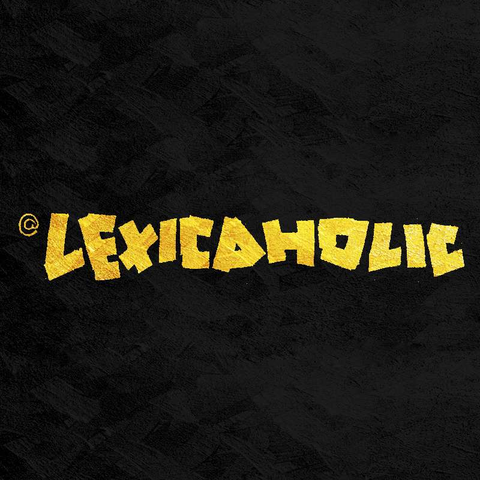

# Avatartist (Avatar-artist)

*This project is for my beloved clients ordering black and white avatars from me.* ❤️

A online tool to feature your black white avatars and [here](http://www-scf.usc.edu/~yankuanz/avatartist/) it is.

## 🎉 Version 2 is released! 🎉
### New features:
1. More background colors besides original **Real Red**:
	- **Why White**
	- **Back Black**
	- **Great Green**
	- **Blah Blue**
2. Improved front-ground color **Yolo Yellow**
3. Donation QR code provided for benefitted users.
4. Redesigned UI.
5. Auto-crop uploaded image to square.

## Source Images
### Foreground Image

### Background Image

## An Example
### Uploaded Image

### Generated Image

## Note
1. Optimized for mobile end.
2. All client-side implementation with JavaScript.

## Oops...
1. It is said it doesn't work well for Android native browsers.
2. iOS device browsers might encounter wrongly rotated images.

## See Also 
See my complete avatar [portfolio](http://www.coroflot.com/yankuan/avatars) made with ❤️ in Los Angeles.

## Acknowledgement 
Special thanks to **Jibin Lyu** for this project.
